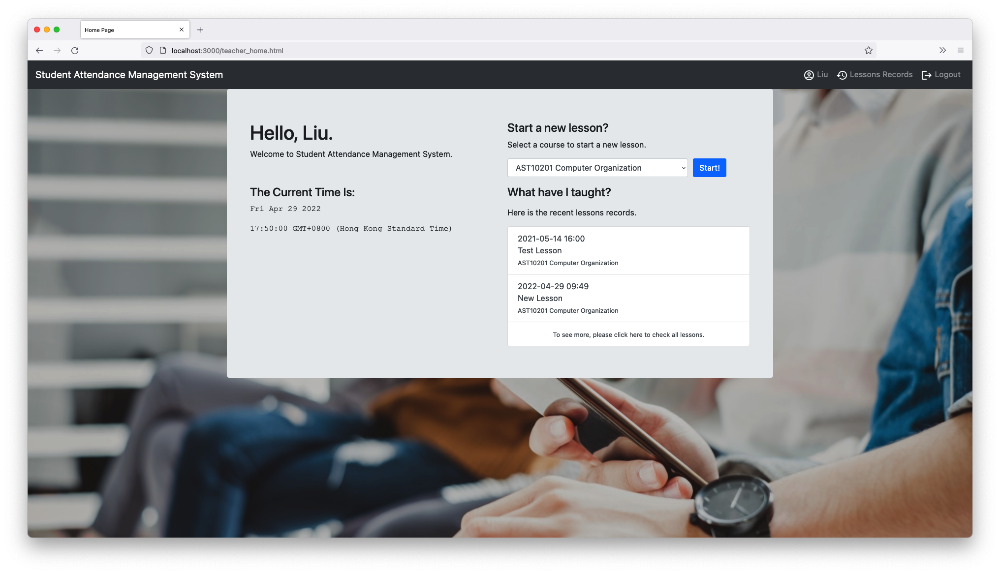
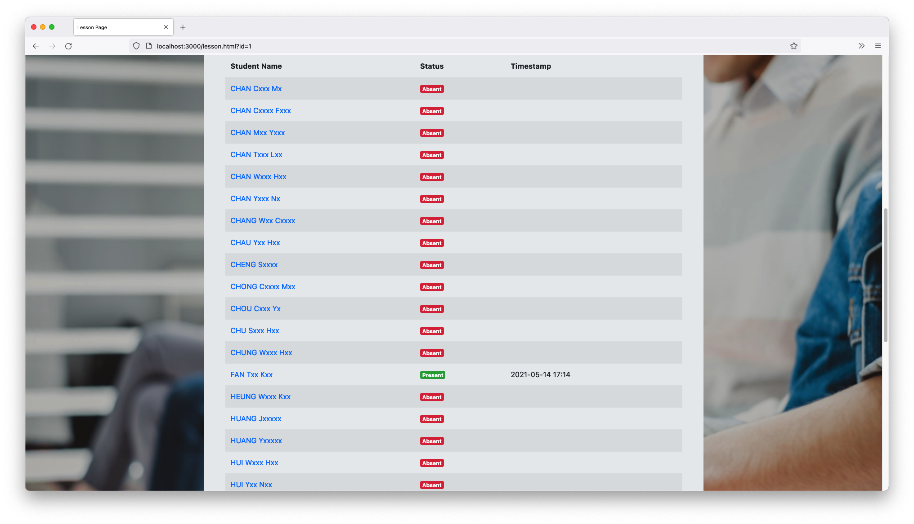

# Student Attendance Management System (SAMS)
SAMS - a Student Attendance Management System built with [ExpressJS](https://expressjs.com/), [Bootstrap](https://getbootstrap.com/), [JQuery](https://jquery.com/) and [MySQL](https://www.mysql.com/).

This is the `ExpressJS` version of this project.








## Getting Started with `docker-compose`

To start with, you must install [Docker](https://www.docker.com/products/docker-desktop) and [docker-compose](https://docs.docker.com/compose/) on your computer.

First, create a `docker-compose.yml` file with the following content:

```yml
version: "3"
services:
  web:
    build: .
    ports:
      - "3000:3000"
    restart: unless-stopped
  db:
    image: mysql/mysql-server:8.0
    restart: unless-stopped
    command: --default-authentication-plugin=mysql_native_password
    environment:
      MYSQL_ROOT_PASSWORD: root
      MYSQL_DATABASE: sams
      MYSQL_USER: sams
      MYSQL_PASSWORD: sams
    volumes:
      - dbdata:/var/lib/mysql
      - ./my.conf:/etc/mysql/my.cnf
      - ./db/:/docker-entrypoint-initdb.d
volumes:
  dbdata:
```

Then, run the command to start the server:
```bash
docker-compose up -d
```

Wait a minutes and open [http://localhost:3000](http://localhost:3000) with your browser to see the result.

## Demo Teacher Account
- username: `liu@test.com`
- password: `testes`

## Demo Student Account
- username: `ftk@test.com`
- password: `testes`

## Learn More

This is a Individual Assignment Project built by [Jacky Fan](https://github.com/redfrogsss) in 2021 for the Course AST20201 Web Programming. 

The following tech is used in this project.
- [ExpressJS](https://expressjs.com/) - the backend solutions of this project.
- [Bootstrap](https://chakra-ui.com/) - the UI solutions of this project.
- [JQuery](https://jquery.com/) - the client-side programming solutions of this project.
- [MySQL](https://www.mysql.com/) - the database of this project.

You can check out [my dirty code in Github](https://github.com/redfrogsss/selfremind) - your feedback are welcome!